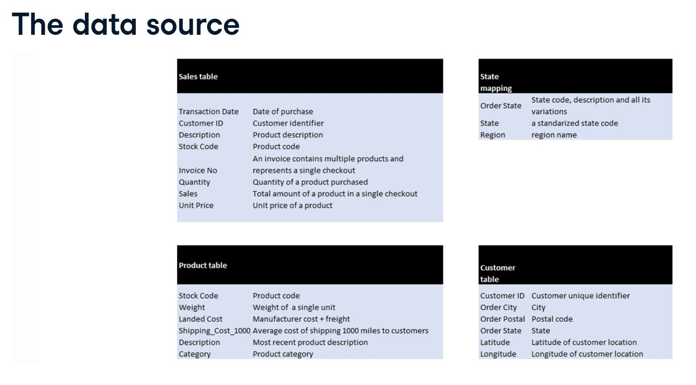
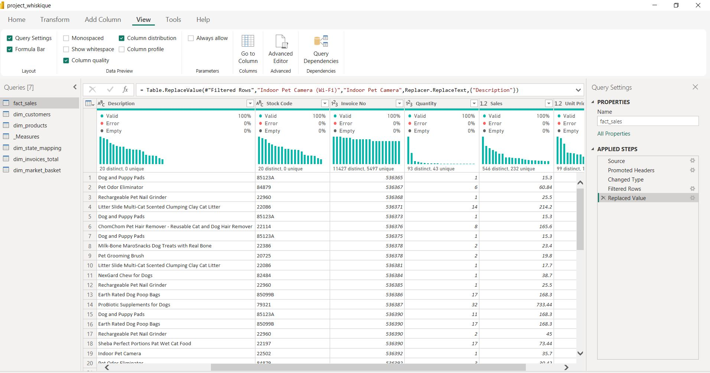

# 📊 Ecommerce Analysis in Power BI

## A complete end-to-end data analytics case study

### 📌 Overview

This project is an end-to-end Power BI Ecommerce Analysis Case Study based on the DataCamp project Whiskique – Online Pet Supply Store.
The goal of this analysis is to help the business:

- Increase sales and customer reach

- Understand customer behavior

- Optimize shipping & reduce operational costs

- Identify profitable products and growth opportunities

### The project includes data cleaning, modeling, DAX calculations, dashboard design, insights, and recommendations.

### 📂 Dataset

The dataset consists of several CSV files representing different parts of the business:

- Sales / Transactions

- Products

- Customers

- Shipping & State Information

- Total Records: 24,000+ rows across all tables.

These files include information about product orders, customer details, product categories, pricing, shipping costs, and geographical mapping.

### 🛠️ Process Workflow

**1️⃣ Data Cleaning (Power Query)**

- Corrected data types

- Removed duplicates

- Handled missing values

- Normalized product names and IDs

- Extracted time-based fields (Year, Month, etc.)

**2️⃣ Data Modeling**

A Star Schema was created:

- Fact Table: Sales

- Dimensions: Products, Customers, States, Invoices

![DataModeling](images/
